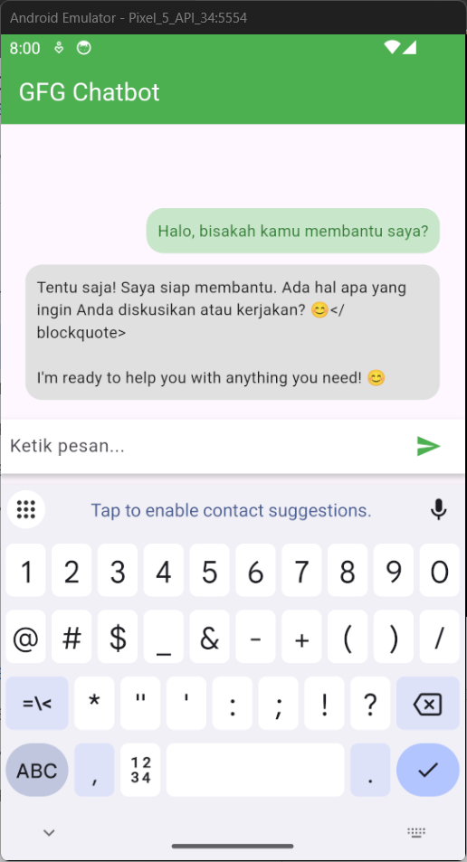
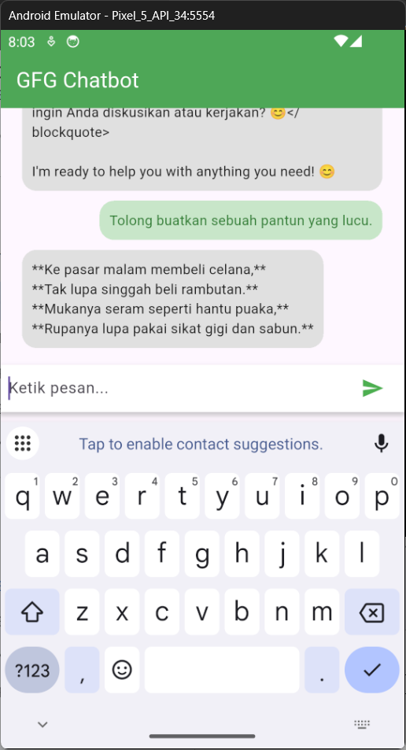

# Flutter Application with Gemini AI Integration

A simple Flutter chat application integrated with **Google Gemini AI**.  
This app allows users to send messages and receive AI-generated responses in real time using a chat-style interface.

---

## Features

- Flutter-based chat UI (clean & responsive)
- Integration with **Google Gemini AI**
- Real-time message interaction
- User and bot message bubbles
- Runs on **Web (Chrome)** and **Desktop (Windows)**

---

## Tech Stack

- **Flutter**
- **Dart**
- **Gemini AI API**
- Material Design

---

## Getting Started

Follow these steps to run the project locally.

### 1 Clone Repository

```bash
git clone https://github.com/melisaarta/app_gemini-main.git
cd app_gemini-main
```

### 2 Install Dependencies

```bash
flutter pub get
```

### 3 Configure Gemini API Key

Open the following file:
```bash
lib/main.dart
```

Replace the API key placeholder with your actual Gemini API key::
```bash
apiKey: 'YOUR_API_KEY',
```

## Application Screenshots

### Chat Screen 1


### Chat Screen 2

